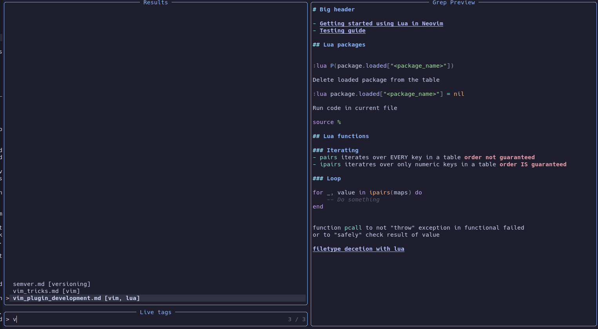

# Fuzzy-tag.nvim

Fuzzy file search by tags.
For those who want to use the tag system but don't modify source files.



## Install the plugin
```lua
-- Packer
use("nvim-lua/plenary.nvim")
use("kkharji/sqlite.lua")
use("nvim-telescope/telescope.nvim")
use("kurotych/fuzzy-tag.nvim")
...
require("fuzzy-tag").setup({})
```
Initialize working directory with `git init` command

## Commands
- `AddTag <tag_name>` - Add tag to current file 
- `RemoveTag <tag_name>` - Remove tag from current file
- `:lua require("fuzzy-tag.cmd").fuzzy_search_cmd()` - Start fuzzy search

## Bindings
```lua
local fuzzy_tag = require("fuzzy-tag.cmd")
vim.keymap.set('n', 'ft', function() fuzzy_tag.fuzzy_search_cmd() end)
```
